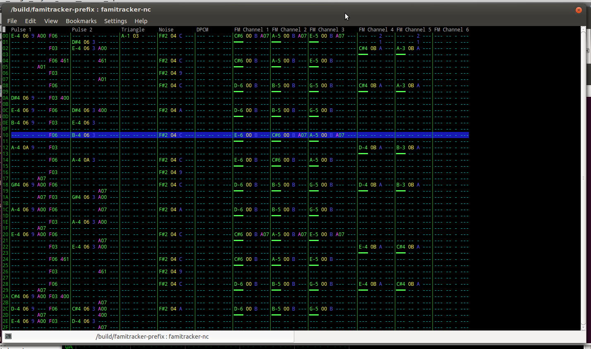

# FamiTracker CX

**This is an old project that I worked on. It has since been discontinued.**
I'm putting it here for "historical" reasons.

Most of the core code is written by Jonathan Liss (jsr) and other contributors,
as taken from the original FamiTracker project at
[http://famitracker.com/](http://famitracker.com/). Almost everything in the
`famitracker-core` directory, with some changes by me, is written by him.
Everything else not in `famitracker-core` is written by Dan Spencer.

## What is FamiTracker CX?
FamiTracker CX is a free cross-platform fork of FamiTracker.

FamiTracker CX is created in order to bring the popular NES/Famicom music
tracker to Linux. More platforms such as Mac OS X are planned when circumstances
permit them.

The optional GUI is rewritten from scratch using the cross-platform Qt 4
library. An ncurses player is also available for terminal nerds.

ALSA and JACK are the two supported audio APIs. More are planned as the Windows
and OS X ports are completed.

The software license is mixed GPL v2/New BSD.

## Post-Mortem
### Challenges
* Porting MFC/Win32 to Qt
* Modularising the original code into reusable components, as a requirement to
  allow for many UI frontends.
  (the original kept all .cpp files in a single directory!)
* Lingering undefined behavior created bugs in the Linux version

### Coding Mistakes in FamiTracker CX
* The "thread pool" is not actually a thread pool, but a message queue.
* Using the `type_t` notation on structs and not typedefs.
* Using global state to keep document data for the Qt GUI.
* The sound sink implementations abused inheritence, leading to many audio bugs.
* Using C++
 * It's unfortunately needed to use Qt and the original code base.
   Many people tolerate C++---and it gives good results---but it's frankly
   complicated and is hence a terrible language.
   A language like C, given its simplicity, would have served better.

### If this project were attempted again
Closer coordination with the original author (jsr) to organize the code base to
become reusable. There would have been much to ask from jsr, such as keeping a
development branch available at all times through Git or some other DVCS.
That alone I think would have solved many of the problems being addressed
by this project.

Ultimately, many open source projects suffer from organizational issues.
This is a primary reason I think forks of projects are created instead of
everyone contributing to a single project. That's why I created a fork
for FamiTracker CX, but it was probably a misplaced reason.

